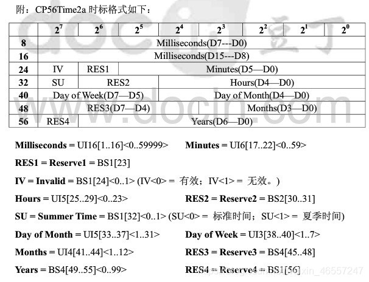

# CP56Time2a

CP56time2a时标格式是101/104规约中定义的一种标准格式。101和104是电力通信规约的一种，2000年左右进行了修订，现在使用的104规约应该就是2000年的版本。下面是网上找的一张关于CP56time2a时标格式的很常见的图。



## 表格及时间项分析
该时标格式使用7个字节来表示时间信息，一个字节包含8位二进制数。

在上图的表中体现为——从最左侧8所在的行开始，到下面56所在的行，共7行。每一行表示一个字节，每行从右向左依次是该字节的第一位（最低位）、第二位、……、第七位、第八位（最高位）。

通过以上分析可以看出，该时标格式使用56个二进制数（56bit）存储时间信息，这56个数分别有对应的序号（1-56）。第一个字节的8位二进制数对应的序号从左往右依次是1-8，而第七个字节的8位二进制数对应的序号依次是49~56，所以表左下方的数是56。

在表下方的每一项的注释中，方括号[]前面的UIn 的意思是该项使用了n位二进制数来表示，方括号[]里的内容是这些二进制数的序号，而后面尖括号<>里面的内容则是该数据项的取值范围。
比如Milliseconds项，表示时间中的秒，单位毫秒；UI16即使用16位二进制数表示该项，方括号[]中的1…16即这16位二进制数的序号是1-16，因此Milliseconds占用了两个字节；尖括号中的0…59999即时间信息中秒的范围是0-59999ms，也就是0.000~59.999s。再比如Day of Week项，表示时间中的星期日项（即当天是星期几）；UI3即使用3位二进制数表示该项；[38…40]表示这三位二进制数的序号；<1…7>表示该项的范围，共7种可能（周一、周二…周日）。

了解各个时间项的表示后，其他项（IV、SU、RES）则并不难理解了。

## 补充说明
1. 时间项年（即Years）的范围是0~99，是因为104规约是在2000年修订，因此以2000年为基准计算年份。
2. CP56time2a时标格式示例（已转为十进制）：
34271 37 18 6 29 11 20（毫秒、分、时、星期日、月份日、月、年）

# 使用

## 安装

```
npm install --save @zsea/cp56time2a
```

## 使用

```javascript
import CP56Time2a from '../index';
```

## 实例化对象

```javascript
let d1=new CP56Time2a();
let d2=new CP56Time2a(new Date());
let d3=new CP56Time2a(buffer:Buffer);
```

## 转换为Buffer

```javascript
d1.toBuffer();
```